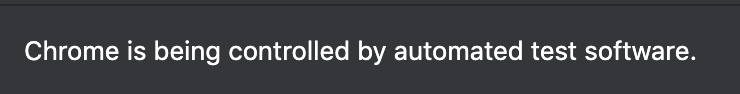

# Facebook Comment Scraper
## Overview
This scraper will scrape facebook comment, with all the comment replies, and save it as a JSON file. And there's one API endpoint to manipulate how the scraper will do it's job. 
Build with minimalistic django framework, and the combination between selenium and beautifulsoup

## Requirement
To get started, you need to install these following applications:
1. Python 3, make sure you have python 3 installed
2. Virtualenv
3. Supported browsers, you can check [here](https://www.selenium.dev/documentation/en/getting_started_with_webdriver/browsers/)
4. Webdriver, make sure you download with correct OS you are using and the driver version should match with the browser version, you can download the driver [here](https://www.selenium.dev/documentation/en/getting_started_with_webdriver/browsers/). This project currently using Chrome driver on macOS

## Instalation
Lets begin installing the package:
 1. Clone this repository: `git clone https://github.com/maulanaahmadarif/facebook-comment-scraper.git`.
 2. `cd facebook-comment-scraper`
 3. Create virtualenv `virtualenv env`
 4. Activate virtualenv `source env/bin/activate`
 5. Install the packages `pip install -r requirements.txt`

## Usage
With all the packages installed, now lets run the app
 1. `cd scrapapi` 
 2. Run the server `python manage.py runserver` it should running on port `8000` on your localhost
 
> Currently, the webpage URL is hardcoded

Now, open `http://localhost:8000/api`, hit enter and it should open new browser depending on your webdriver selection, and the scraper is starting

# 

> Don't prevent any click event, it will break the scraper

The API has 3 parameter as listed below:

| query | type | defaultValue | description
|--|--|--|--|
| limit | `Int` | `null` |  |
| offset | `Int` | `0` |  |
| reply | `Boolean` | `false` | if `true` the response will display the comment replies |
